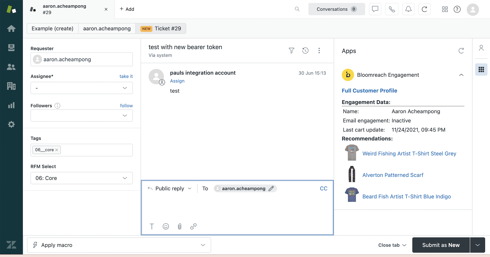
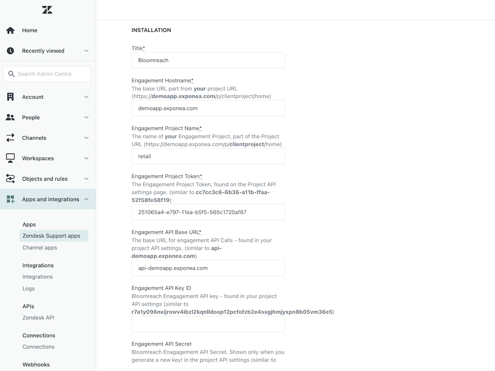

# Bloomreach Engagement

 Bloomreach Engagement data available directly inside you Zendesk sidebar. Click on the Engagement logo to access the full client.

  

### View:

* Customer Attributes

* Customer Segmentation

* Customer Aggregates

* Customer Recommendations and Predictions

Or anything which can be accessed via the Bloomreach Engagement Customer API.
    
### Screenshots:




### Installation

1) Input your engagement project id - this can be found in the project settings > project_token area of your Engagement project.
2) Input your engagement hostname. This is the domain of your Engagement admin interface - e.g. demo_project.exponea.com  
3) Input your engagement API hostname. This is available at project settings > api Base URL.
4) In Engagement, generate an API keypair for a private group with read-only access to Managed Endpoint API and all the data fields you are interested in. Turn these into a base 64 encoded token. An easy way to achieve this is to install nodejs, start the repl and paste: ```console.log(Buffer.from('<public_key>:<private_key>').toString("base64"))``` - put this value into the Engagement_token field
5) The final thing to do is to configure the fields you would like to display. You have 2 options here:
6) Use Managed Endpoint API - configured in [BR Engagement UI](https://documentation.bloomreach.com/engagement/reference/managed-endpoints-api). Make sure the API group configured has access to Managed Endpoint API. Don't forget to enable the Managed Endpoint API and use the URL provided for this endpoint into Engagement Managed Endpoint API URL field. The Managed API payload can be fully custom and looks like this:
```
{
	"Name": "{{ customer.first_name }} {{ customer.last_name }}",
	"Email engagement": "{{ segmentations['5fc3d611a59cf881d45b2ff6'] }}",
	"Last cart update": "{{ expressions['5f5776b57e8f28c9c93d2c90'] | from_timestamp('US')  }}",
	"html": "<b>Recommendations:</b><table><tr><td><a href='{{ item.url }}' target=_blank></a></td><td><a href='{{ item.url }}' target=_blank>{{ item.title }}</a></td></tr></table>"	
}
```

7) Alternativelly, if no Managed Endpoint is used, use Data API to fetch raw data. This is configured in the Engagement_payload field as a JSON object in the form:

```
{
  "fields" : [
  {
	   "type": "segmentation attribute etc",
	   "id" : "the internal Engagement id of the field",
	   "label" : "what you want the name to be when display inside Zendesk"
	 },
	 {...},
	 {...}
   ]
} 
```

The exact values you require can be found by referring to the Bloomreach Engagement API Reference [here](https://documentation.bloomreach.com/engagement/reference/welcome).