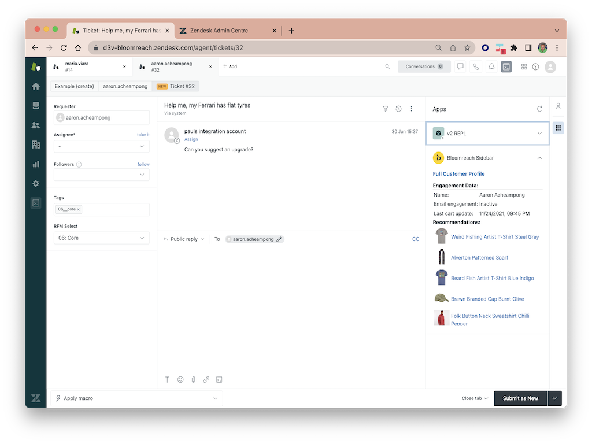

# Bloomreach Engagement Sidebar Widget

 Bloomreach Engagement data is made available directly inside your Zendesk sidebar.

### 360° View of your customers 

* Customer Attributes
* Segmentation
* Detailed Aggregates, Lifetime Value, Loyalty Tier
* Recent Interactions with your products and categories
* Present the Recommendations and Predictions for Agents to have better-tailored interactions with customers
* Link directly to full customer profile in Bloomreach Engagement

### Update the data in Bloomreach Engagement

* Send information about customers' interaction with your support team as Events into Bloomreach Engagement. You can use this additional information to better segment your users and target campaigns, and improve the personalized experience your customers receive.
    
### Screenshots:




### Installation

1. Title

 The headline of the sidebar widget - eg. `Customer Details`.

2. Engagement Hostname

 The base URL part from **your** project URL, eg. `https://`**`demoapp.exponea.com`**`/p/clientproject/home`.

3. Engagement Project Name

 The name of **your** Engagement Project, part of the Project URL, `https://demoapp.exponea.com/p/`**`clientproject`**`/home`.

4. Input your Engagement Project Token

 Information on your project token can be found [here](https://documentation.bloomreach.com/engagement/docs/project-settings-2). Looks like similar to `cc7cc3c6-6b36-a11b-ffaa-52f58fe58f19`.

5. Input your engagement API Base URL

 This is available at `Project Settings` -> `Api Base URL`. Looks like **`api-demoapp.exponea.com`**

6. API Key ID and API Key Secret

 In `Engagement Settings` > `Access Management` > `API`, generate an API keypair for a `private group` that you create, with read-only access to `Managed Endpoint API` and all the data fields you are interested in. For more details, please see [documentation on authentication](https://documentation.bloomreach.com/engagement/reference/authentication).

7. The final thing to do is to configure the fields you would like to display. You have 2 options here:

  1. Use `Managed Endpoint API` - configured in [BR Engagement UI](https://documentation.bloomreach.com/engagement/reference/managed-endpoints-api). Ensure the API group configured has access to this newly created `Managed Endpoint API`. Don't forget to enable the Managed Endpoint API and copy the URL provided for this endpoint into the Engagement Managed Endpoint API URL field. 

        The Managed API payload is fully custom and looks like this:

      ```
      {
          "Name": "{{ customer.first_name }} {{ customer.last_name }}",
          "Email engagement": "{{ segmentations['5fc3d611a59cf881d45b2ff6'] }}",
          "Last cart update": "{{ expressions['5f5776b57e8f28c9c93d2c90'] | from_timestamp('US')  }}",
          "html": "<b>Recommendations:</b><table><tr><td><a href='{{ item.url }}' target=_blank></a></td><td><a href='{{ item.url }}' target=_blank>{{ item.title }}</a></td></tr></table>"  
        }
      ```

  2. Alternatively, if no Managed Endpoint is used, use [Data API](https://documentation.bloomreach.com/engagement/reference/customer-attributes-2) to fetch raw data. The data requested is configured in the `Engagement_payload` field as a JSON object in the form:

        ```
        {
            'fields' : [
                {
                'type': 'segmentation attribute etc',
                'id': 'the internal Engagement id of the field',
                'label': 'How you would like the field labelled in your Zendesk sidebar'
                },
                {...another field...},
                {...another field...}
            ]
        }
        ```

        The JSON above is the exact JSON passed to the [customer attribute API call](https://documentation.bloomreach.com/engagement/reference/customer-api-overview-1) extended with a 'label' field as a friendly display name within Zendesk.

        The exact values you require can be found by referring to the Bloomreach Engagement API Reference [here](https://documentation.bloomreach.com/engagement/reference/welcome).

8. If you want to send data and updates into Bloomreach Engagement, the Webhook configuration is already automatically created for you. Now you need to [create triggers in Zendesk](https://support.zendesk.com/hc/en-us/articles/4408886797466-Creating-triggers-for-automatic-ticket-updates-and-notifications) that send Events to Bloomreach Engagement. To do this, go to `Admin` -> `Objects and rules` -> `Business Rules` -> `Triggers`. Then create a new trigger, name it, and give it a description and category.

 Under `Conditions` you will need to specify the situations when the Trigger runs. If you want to notify Bloomreach Engagement of a ticket being created and then consequently closed/solved, you can use the logic below.

 Under `Actions`, you will want to select `Notify active webhook` and select the Bloomreach webhook from the second dropdown.

 **Configuration of the `POST` request body**, that will be sent when triggering the webhook, **is required**. It needs to adhere to the format of the Bloomreach Engagement Tracking API endpoint. This is a simple example of payload: 
 
  ```
  {
    "customer_ids": {
        "registered": "{{ticket.requester.email}}"
    },
    "properties": {
        "body": "{{ticket.description}}",
        "status": "{{ticket.status}}",
        "subject": "{{ticket.title}}",
        "type": "{{ticket.ticket_type}}",
        "ticket_id": "{{ticket.id}}",
        "priority": "{{ticket.priority}}",
        "support_suite": "Zendesk"
    },
    "event_type": "support_ticket"
	}
```
